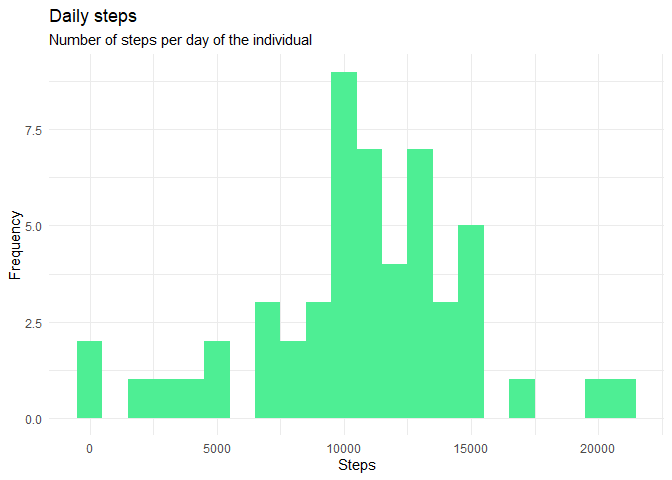

## Loading and preprocessing the data

```r
library(data.table)
library(ggplot2)
library(dplyr)
```

```
## 
## Attaching package: 'dplyr'
```

```
## The following objects are masked from 'package:data.table':
## 
##     between, first, last
```

```
## The following objects are masked from 'package:stats':
## 
##     filter, lag
```

```
## The following objects are masked from 'package:base':
## 
##     intersect, setdiff, setequal, union
```

```r
activity_data <- fread("activity.csv")
```

## What is mean total number of steps taken per day?
1. Calculate the total number of steps.  


```r
total_steps <- activity_data[, lapply(.SD, sum, na.rm = FALSE), 
                             .SDcols = c("steps"), by = .(date)]
```

2. Make a histogram of the total number of steps taken per day

```r
total_steps %>% ggplot(aes(steps)) +
    geom_histogram(fill = "seagreen2", binwidth = 1000) + 
    labs(x = "Steps", y = "Frequency", title = "Daily steps",
         subtitle = "Number of steps per day of the individual") + 
    theme_minimal()
```

```
## Warning: Removed 8 rows containing non-finite values (stat_bin).
```

<!-- -->

3. Calculate the mean and median

```r
total_steps[, .(mean_steps = mean(steps, na.rm = TRUE), 
                  median_steps = median(steps, na.rm = TRUE))]
```

```
##    mean_steps median_steps
## 1:   10766.19        10765
```

## What is the average daily activity pattern?
1. Make a time series plot (i.e. 𝚝𝚢𝚙𝚎 = "𝚕") of the 5-minute interval (x-axis) and the average number of steps taken, averaged across all days (y-axis)


```r
interval_steps <- activity_data[, lapply(.SD, mean, na.rm = TRUE), 
                             .SDcols = c("steps"), by = .(interval)]
interval_steps %>% 
    ggplot(aes(interval, steps)) +
    geom_line(col = "purple", size = 0.5) + 
    labs(title = "Average daily steps", subtitle = "Avg. daily steps per interval") +
    theme_minimal()
```

<!-- -->
2. Which 5-minute interval, on average across all the days in the dataset, contains the maximum number of steps?


```r
interval_steps$interval[which.max(interval_steps$steps)]
```

```
## [1] 835
```

## Imputing missing values
1. Calculate and report the total number of missing values in the dataset (i.e. the total number of rows with 𝙽𝙰s)


```r
sum(is.na(activity_data$steps))
```

```
## [1] 2304
```

2. Devise a strategy for filling in all of the missing values in the dataset. The strategy does not need to be sophisticated. For example, you could use the mean/median for that day, or the mean for that 5-minute interval, etc.


```r
# Filling in missing values with the average of the corresponding 5-min interval 
for(i in 1:nrow(activity_data)) {
    if (is.na(activity_data$steps[i])) {
        interval <- activity_data$interval[i]
        activity_data$steps[i] <- 
            interval_steps$steps[which(interval_steps$interval == interval)]
    }
}
```

3. Create a new dataset that is equal to the original dataset but with the missing data filled in.  

```r
data.table::fwrite(activity_data, file = "tidy_data.csv", quote = FALSE)
```

4. Make a histogram of the total number of steps taken each day and calculate and report the mean and median total number of steps taken per day. Do these values differ from the estimates from the first part of the assignment? What is the impact of imputing missing data on the estimates of the total daily number of steps?


```r
total_steps_new_data <- activity_data[, c(lapply(.SD, sum)), .SDcols = c("steps"), by = .(date)]

total_steps_new_data %>% ggplot(aes(steps)) +
    geom_histogram(fill = "seagreen2", binwidth = 1000) + 
    labs(x = "Steps", y = "Frequency", title = "Daily steps",
         subtitle = "Number of steps per day of the individual") + 
    theme_minimal()
```

<!-- -->

```r
total_steps_new_data[, .(mean_steps = mean(steps), median_steps = median(steps))]
```

```
##    mean_steps median_steps
## 1:   10766.19     10766.19
```

Estimate | Mean_Steps | Median_Steps
--- | --- | ---
First Part (with na) | 10766 | 10765
Second Part (fillin in na with avg of 5 min interval) | 10766 | 10766

## Are there differences in activity patterns between weekdays and weekends?
1. Create a new factor variable in the dataset with two levels – “weekday” and “weekend” indicating whether a given date is a weekday or weekend day.

```r
activity_data <- fread("activity.csv")
activity_data[, date := as.POSIXct(date, format = "%Y-%m-%d")][, day_of_week := weekdays(date)]
activity_data[grepl(pattern = "Monday|Tuesday|Wednesday|Thursday|Friday", x = day_of_week), "time_of_week"] <- "weekday"
activity_data[grepl(pattern = "Saturday|Sunday", x = day_of_week), "time_of_week"] <- "weekend"
activity_data[, time_of_week := as.factor(time_of_week)]

interval_steps <- activity_data[, c(lapply(.SD, mean, na.rm = TRUE)), 
                                .SDcols = c("steps"), 
                                by = .(interval, time_of_week)]
```
2. Make a panel plot containing a time series plot (i.e. 𝚝𝚢𝚙𝚎 = "𝚕") of the 5-minute interval (x-axis) and the average number of steps taken, averaged across all weekday days or weekend days (y-axis)

```r
interval_steps %>%
    ggplot(aes(interval, steps, col = time_of_week)) + 
    geom_line() + 
    labs(title = "Average daily steps by time of week", 
         subtitle = "Avg. daily steps per interval") +
    theme_minimal()
```

<!-- -->
